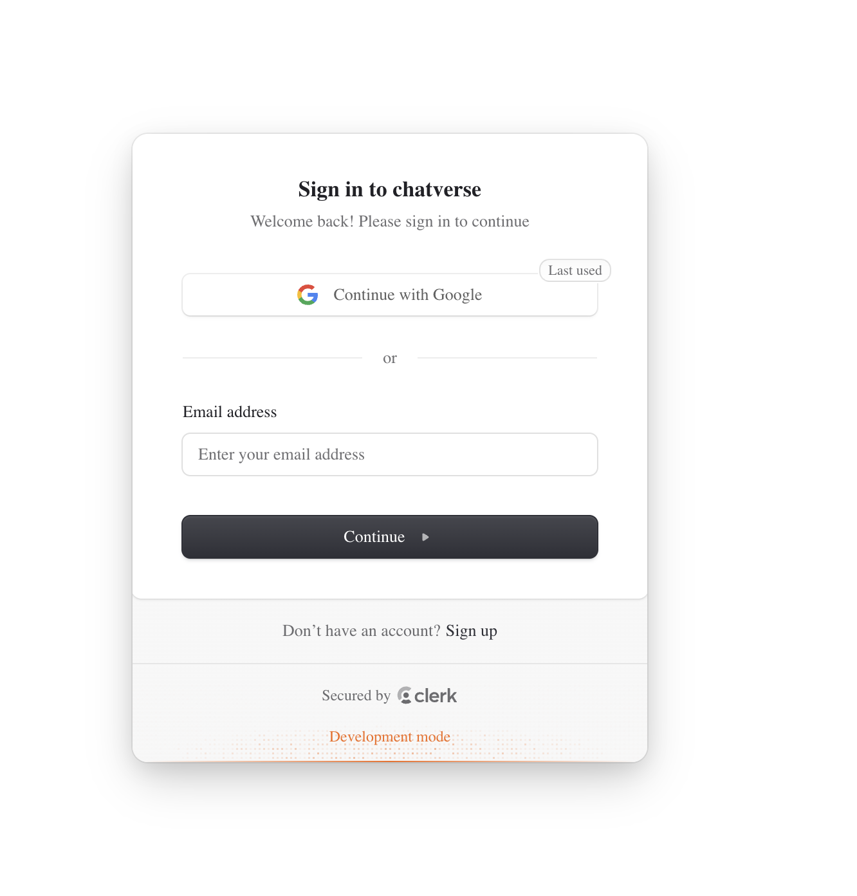
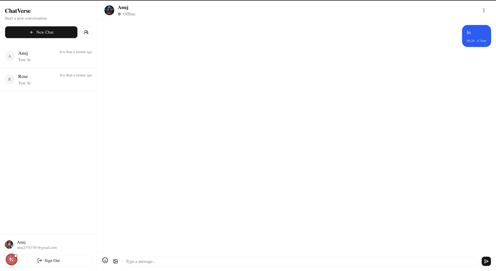
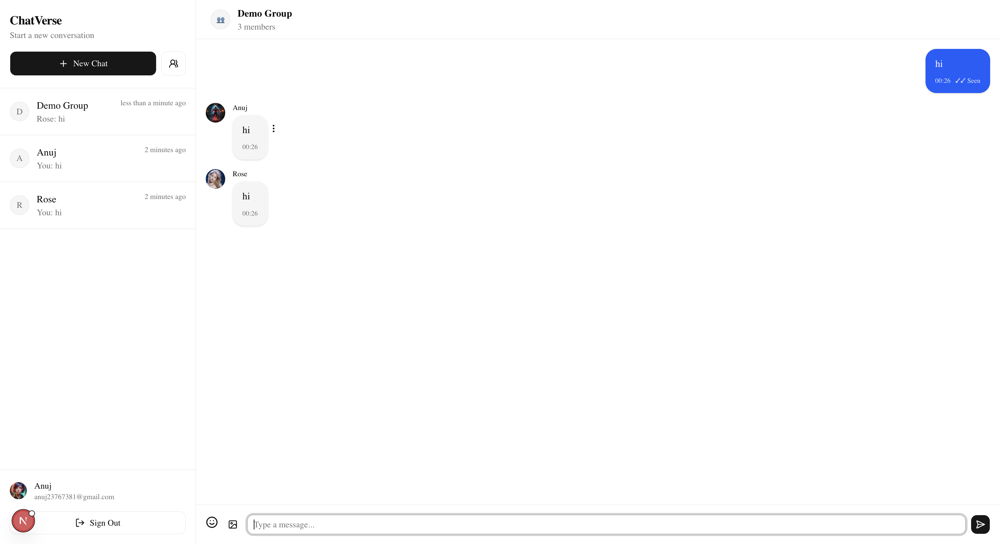
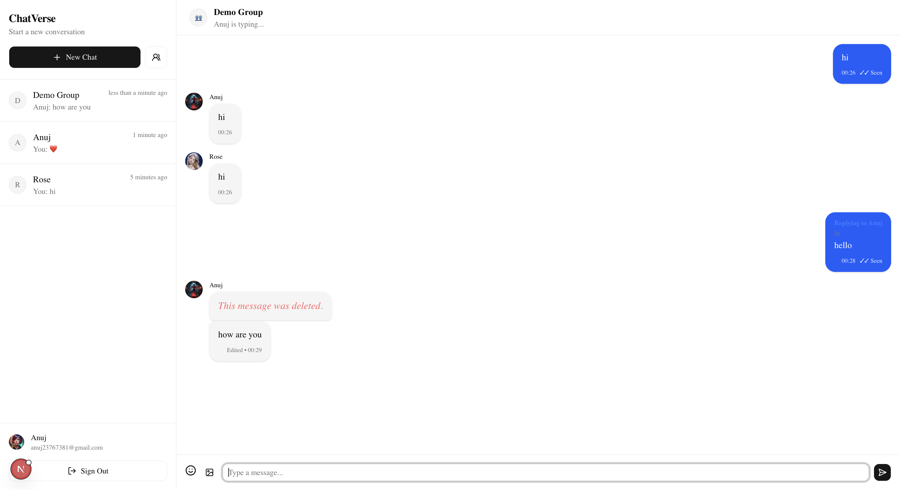

# Chatverse

Chatverse is a realtime chat application built with **Next.js**, **Convex**, and **Clerk**. It combines a reactive Convex backend for instant message delivery with Clerk-based authentication, Cloudinary-powered media uploads, and a modern shadcn/ui interface.

## 🔗 Links

- **Live Demo:** [chatverse-five-vert.vercel.app](chatverse-five-vert.vercel.app)
- **Repository:** [github.com/anuj2731997/Chatverse](https://github.com/anuj2731997/Chatverse)

## Tech Stack

| Layer | Technology |
|---|---|
| Framework | [Next.js 16](https://nextjs.org/) (App Router) + [React 19](https://react.dev/) |
| Language | TypeScript |
| Backend / Realtime DB | [Convex](https://convex.dev/) |
| Authentication | [Clerk](https://clerk.com/) (`@clerk/nextjs`, `@convex-dev/auth`) |
| Media Storage | [Cloudinary](https://cloudinary.com/) |
| UI Components | [shadcn/ui](https://ui.shadcn.com/), Radix/`@base-ui/react`, `lucide-react` |
| Styling | Tailwind CSS v4 |
| Other | `emoji-picker-react`, `cmdk`, `recharts`, `embla-carousel-react`, `sonner`, `next-themes` |

## Features

### 🔐 Authentication
- Clerk Authentication
- Google Sign-In
- Secure session management
- Automatic user synchronization with Convex

### 💬 Messaging
- Real-time messaging
- Send text messages
- Image sharing using Convex Storage
- Emoji picker
- Reply to messages
- Edit messages
- Delete messages
- Message timestamps
- Deleted message indicators
- Edited message indicators

### 👥 Conversations
- One-to-one conversations
- Group conversations
- Create groups
- Group member management
- Group details page
- Conversation sorting by latest message
- Hide/Delete chat (only for current user)

### ⚡ Real-time Features
- Online / Offline presence
- Last seen
- Typing indicator
- Multiple typing users
- Read receipts
- Delivered status
- Unread message count
- Automatic mark-as-read

### 😀 Reactions
- React to messages with emojis
- Toggle reactions
- Real-time reaction updates

### 🖼 Image Sharing
- Upload images
- Image preview before sending
- Image validation
- Click image to view full size

### 📱 User Experience
- WhatsApp-inspired UI
- Responsive design
- Smooth scrolling
- Jump to replied message
- Conversation previews
- Last message preview
- Relative timestamps
- Conversation search
- Modern dropdown menus
- Confirmation dialogs

## 📸 Screenshots

### Login


### Chat Screen


### Group Chat



### Reply UI


### Typing Indicator



## Project Structure

```
Chatverse/
├── app/                 # Next.js App Router pages, layouts, and routes
├── components/          # Reusable UI components (shadcn/ui based)
├── convex/              # Convex schema, queries, mutations, and auth config
├── features/            # Feature-specific modules/logic
├── hooks/                # Custom React hooks
├── lib/                 # Shared utilities/helpers
├── public/              # Static assets
├── .agents/skills        # Agent skill configs
├── .claude/skills        # Claude skill configs
├── proxy.ts              # Proxy configuration
├── sample.env             # Example environment variables
└── package.json
```

## Getting Started

### Prerequisites

- [Node.js](https://nodejs.org/) (LTS recommended)
- npm (or your preferred package manager)
- A [Convex](https://convex.dev/) account/project
- A [Clerk](https://clerk.com/) application
- A [Cloudinary](https://cloudinary.com/) account with an unsigned upload preset

### 1. Clone the repository

```bash
git clone https://github.com/anuj2731997/Chatverse.git
cd Chatverse
```

### 2. Install dependencies

```bash
npm install
```

### 3. Configure environment variables

Copy `sample.env` to `.env.local` and fill in your own values:

```bash
cp sample.env .env.local
```

```env
# Convex Configuration
CONVEX_DEPLOYMENT="your-convex-deployment"
NEXT_PUBLIC_CONVEX_URL="https://your-project.convex.cloud"
NEXT_PUBLIC_CONVEX_SITE_URL="https://your-app.vercel.app"

# Clerk Authentication
NEXT_PUBLIC_CLERK_PUBLISHABLE_KEY="pk_test_..."
CLERK_SECRET_KEY="sk_test_..."
CLERK_JWT_ISSUER_DOMAIN="https://your-project.clerk.accounts.dev"

# Cloudinary
NEXT_PUBLIC_CLOUDINARY_CLOUD_NAME="your-cloud-name"
NEXT_PUBLIC_CLOUDINARY_UPLOAD_PRESET="your-upload-preset"
```

### 4. Start Convex

```bash
npx convex dev
```

This provisions/links your Convex deployment and generates the `CONVEX_DEPLOYMENT` value.

### 5. Run the development server

```bash
npm run dev
```

Open [http://localhost:3000](http://localhost:3000) in your browser to see the app.

## Available Scripts

| Command | Description |
|---|---|
| `npm run dev` | Start the Next.js development server |
| `npm run build` | Build the app for production |
| `npm run start` | Start the production server |
| `npm run lint` | Run ESLint |

## 👨‍💻 Author

Built with ❤️ using Next.js, Convex, Clerk, and TypeScript.
